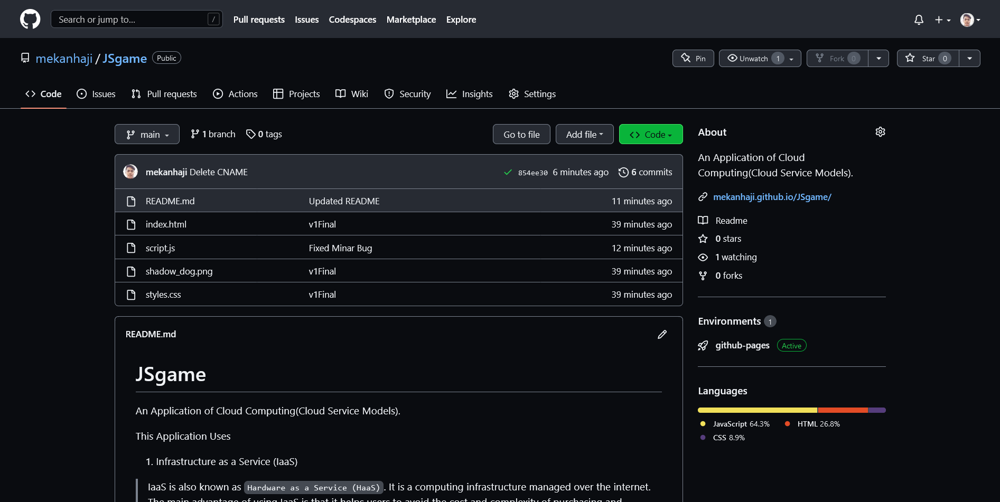

# JSgame

An Application of Cloud Computing(Cloud Service Models).

This Application Uses
1. Infrastructure as a Service (IaaS)
> IaaS is also known as `Hardware as a Service (HaaS)`. It is a computing infrastructure managed over the internet. The main advantage of using IaaS is that it helps users to avoid the cost and complexity of purchasing and managing the physical servers.
>
> This Aplication is being/been Build on Codespace Using 2-Core, 4GB RAM, 32 Storage.
>

2. Platform as a Service (PaaS)
> PaaS cloud computing platform is created for the programmer to develop, test, run, and manage the applications.
>
> We use vs cord (Cloud) to Develop this appliacton.
>

3. Software as a Service (SaaS)
> SaaS is also known as "on-demand software". It is a software in which the applications are hosted by a cloud service provider. Users can access these applications with the help of internet connection and web browser.
>
> This Application is currently Hosted By GitHub pages @ (https://mekanhaji.github.io/JSgame/)
>
